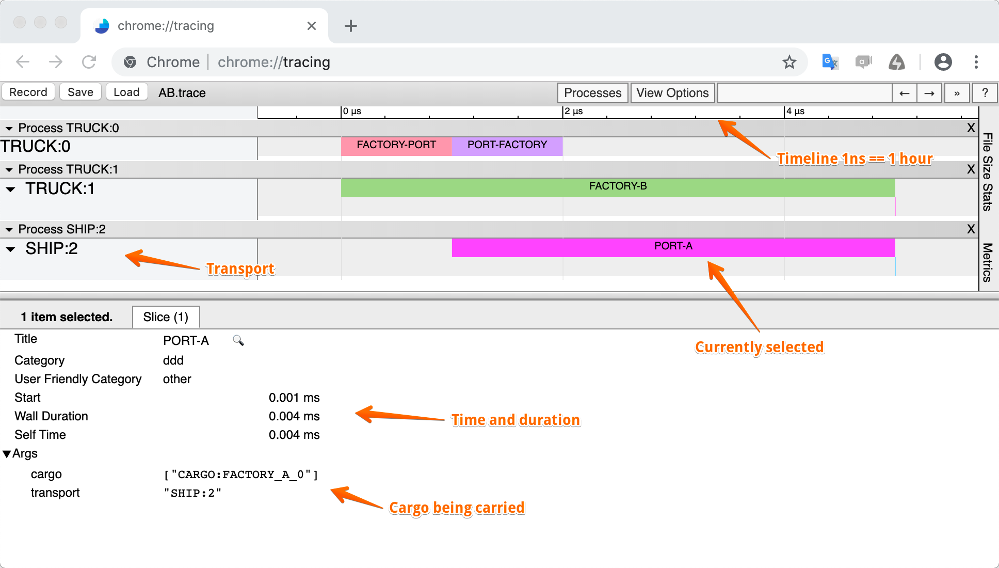
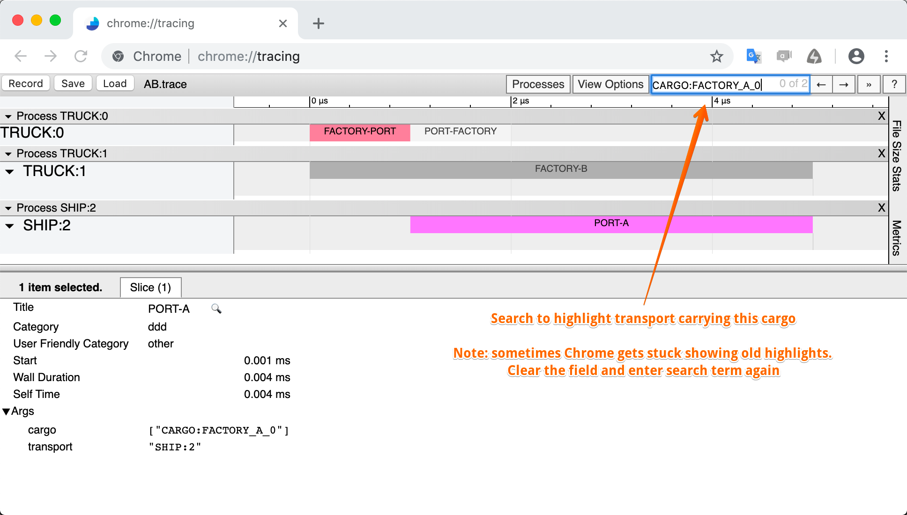
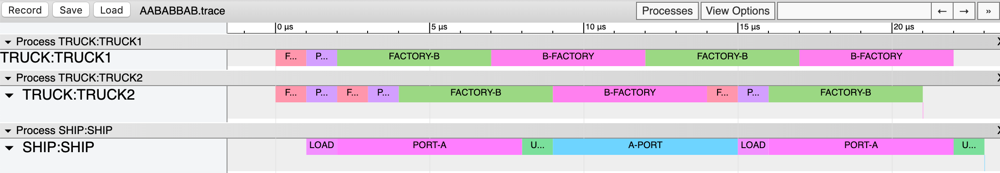
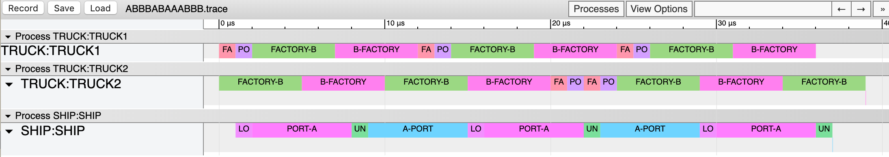

[Back to index](README.md)

# Exercise 1.2

Let's modify our solution so that it would log important events in the following format:

- Log entries are in JSON, one JSON object per line
- Optional text comments could start with `#`, they are ignored

We need to **log an entry when important domain events happen: transport departs and when it arrives**.

A single line in the log might look like the one below. It is pretty-printed here for readability, normally it would be one line:

```json
{
  "event": "DEPART",      // type of log entry: DEPART or ARRIVE
  "time": 0,              // time in hours
  "transport_id": 0,      // unique transport id
  "kind": "TRUCK",        // transport kind
  "location": "FACTORY",  // current location
  "destination": "PORT",  // destination (only for DEPART events)
  "cargo": [              // array of cargo being carried
    {
      "cargo_id": 0,      // unique cargo id
      "destination": "A", // where should the cargo be delivered
      "origin": "FACTORY" // where it is originally from
    }
  ]
}
```

Here is an example event log for the entire `AB` delivery:

```text
# Deliver AB
{"event": "DEPART", "time": 0, "transport_id": 0, "kind": "TRUCK", "location": "FACTORY", "destination": "PORT", "cargo": [{"cargo_id": 0, "destination": "A", "origin": "FACTORY"}]}
{"event": "DEPART", "time": 0, "transport_id": 1, "kind": "TRUCK", "location": "FACTORY", "destination": "B", "cargo": [{"cargo_id": 1, "destination": "B", "origin": "FACTORY"}]}
{"event": "ARRIVE", "time": 1, "transport_id": 0, "kind": "TRUCK", "location": "PORT", "cargo": [{"cargo_id": 0, "destination": "A", "origin": "FACTORY"}]}
{"event": "DEPART", "time": 1, "transport_id": 0, "kind": "TRUCK", "location": "PORT", "destination": "FACTORY"}
{"event": "DEPART", "time": 1, "transport_id": 2, "kind": "SHIP", "location": "PORT", "destination": "A", "cargo": [{"cargo_id": 0, "destination": "A", "origin": "FACTORY"}]}
{"event": "ARRIVE", "time": 2, "transport_id": 0, "kind": "TRUCK", "location": "FACTORY"}
{"event": "ARRIVE", "time": 5, "transport_id": 1, "kind": "TRUCK", "location": "B", "cargo": [{"cargo_id": 1, "destination": "B", "origin": "FACTORY"}]}
{"event": "DEPART", "time": 5, "transport_id": 1, "kind": "TRUCK", "location": "B", "destination": "FACTORY"}
{"event": "ARRIVE", "time": 5, "transport_id": 2, "kind": "SHIP", "location": "A", "cargo": [{"cargo_id": 0, "destination": "A", "origin": "FACTORY"}]}
{"event": "DEPART", "time": 5, "transport_id": 2, "kind": "SHIP", "location": "A", "destination": "PORT"}
```

Given that file, we could do two things with our event logs:

1. Compare the reasoning of our solution to the reasoning from another solution (even though they could be in different languages).
2. Feed it to the trace.py script that will convert this log to Chrome Trace Viewer format file (also JSON, but a different format). That file could be loaded in Chrome to display the outline of our travel.

Here is how the trace for the `AB` delivery might look like:



You can also search for the cargo to highlight the related transport transfers:



Now that we have tools, we could investigate and debug complex flows. The tooling would also make it easier to introduce more intricate domain details to the code.

## Task

- **Extend your solution** to print domain events.
- Run the domain event log through the trace.py converter and then **display in the Chrome Trace tool**. Does the `AABABBAB` solution look right? Does it complete on hour 29? What about `ABBBABAAABBB`?
- Add new rules to the code:
    - **Ship can take up to 4 containers, but is slower now**:
        - Ship takes 1 hour to load *all* cargo
        - Ship takes 1 hour to unload *all* cargo
        - Ship takes 6 hours to travel in each direction
        - Note that ship doesn't wait to be full in order to DEPART. It just LOADs the available cargo and leaves.
- Add `LOAD` and `UNLOAD` events to the domain output. They have a similar schema as `ARRIVE`, are published at the beginning of the operation and have a `duration` field (`0` for TRUCK and `1` for the SHIP)

## Reference traces

*AABABBAB*



*ABBBABAAABBB*


