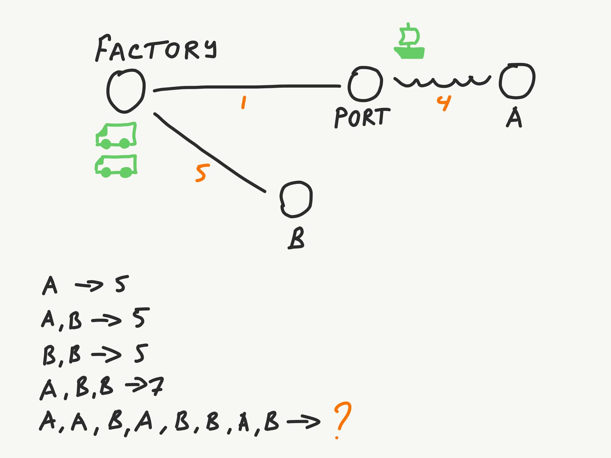

# Transport Tycoon Kata

## Exercises

- [Exercise 1.1](#exercise-11)
- [Exercise 1.2](EXERCISE-1.2.md)

## Exercise 1.1

There is a map containing a Factory, Port, Warehouse A and Warehouse B. Factory has a small stock of containers that have to be delivered to these warehouses.



There are **two trucks and one ship that can carry one container at a time** (trucks start at Factory, ship starts at the Port).

**Traveling takes a specific amount of hours** (represented by an orange number on the map). Time is needed to travel in one direction, and the same amount of time to come back. For example, it takes 5 hours for a truck to travel from the Factory to B.

Transport follows a simple heuristic: **pick the first container from the location** (FIFO), bring it to the destination, then come back home.

A truck that drops off cargo at the Port doesn't need to wait for the ship (there is a small warehouse buffer there). It can drop the cargo and start heading back. Cargo loading and unloading is instant.

Transport moves **in parallel**. One truck might be bringing a container to location A, while the second truck comes back from A, while the ship travels back to the Port.

### Map distances

| Route              | Hours |
|--------------------|-------|
| Factory → Port     | 1     |
| Port → A           | 4     |
| Factory → B        | 5     |

### Task

Write a program that takes a list of cargos from the command line and prints out the number of hours it takes to get them all delivered.

| Input        | Output |
|--------------|--------|
| A            | 5      |
| AB           | 5      |
| BB           | 5      |
| ABB          | 7      |
| AABABBAB     | ?      |
| ABBBABAAABBB | ?      |

### Exercise notes

- Don't worry about making the code extensible. We will evolve the codebase, but the deeper domain dive will start from scratch.
- Don't worry if your numbers don't exactly match answers from your colleagues. There is a small loop-hole in the exercise that makes it non-deterministic. We will address it later.
- Pick whatever language lets you solve the problem quickest. There will be a chance to try new languages later.
- Remember that all processes happen in parallel. Trucks and ship move at the same time, not sequentially.
- Don't worry about applying any patterns (e.g. aggregates or events) at this point. Just get the job done. Implementation patterns will emerge later.

### Bonus

What is the possible reason for different solutions to return different answers?

## AI challenge

As an extra challenge, try to have AI write all the code for you. Use steering files, specs, prompts — whatever you need — but avoid writing production code or tests yourself.

Not feeling that bold? Try one of these lighter variants:
- Let AI write the tests, you write the production code
- You write the tests, let AI write the production code

This is optional, not mandatory. Pick the level you're comfortable with.

## Tech stack

- Kotlin 2.3.0
- JDK 25
- Gradle (Kotlin DSL)

## Getting started

```bash
./gradlew build
./gradlew run --args="AABABBAB"
```
